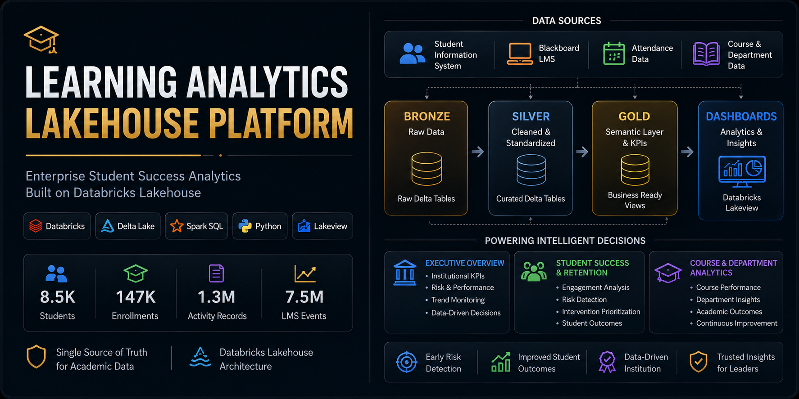
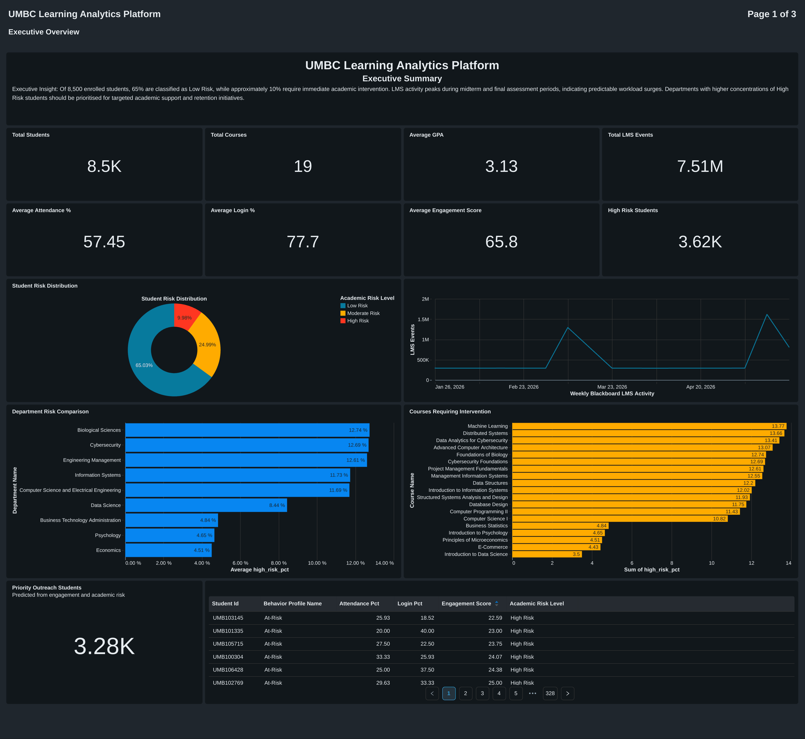
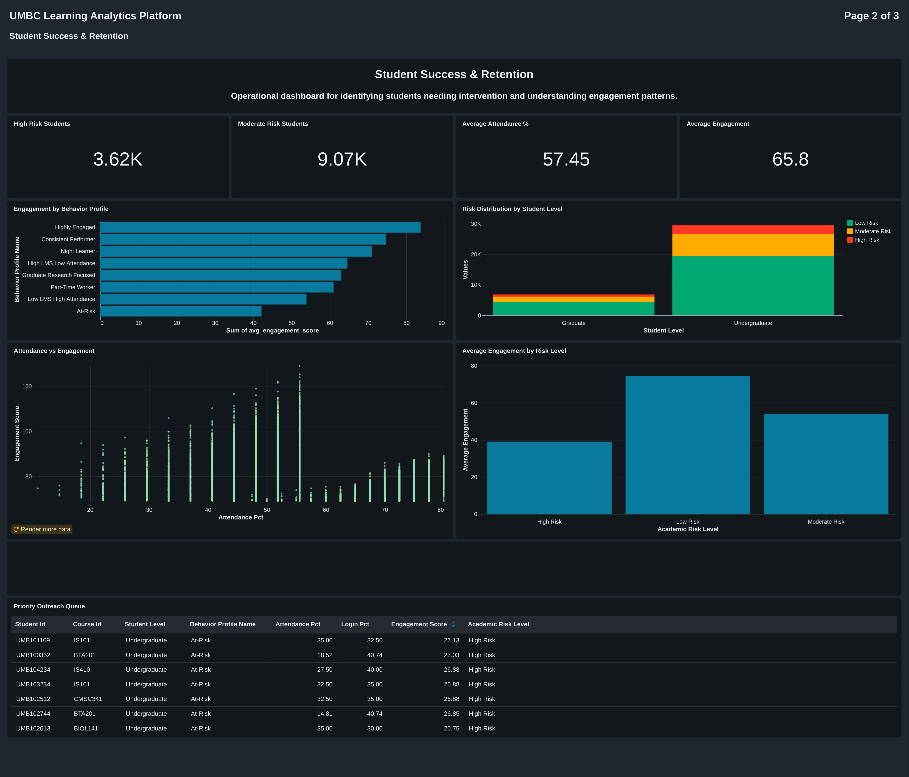
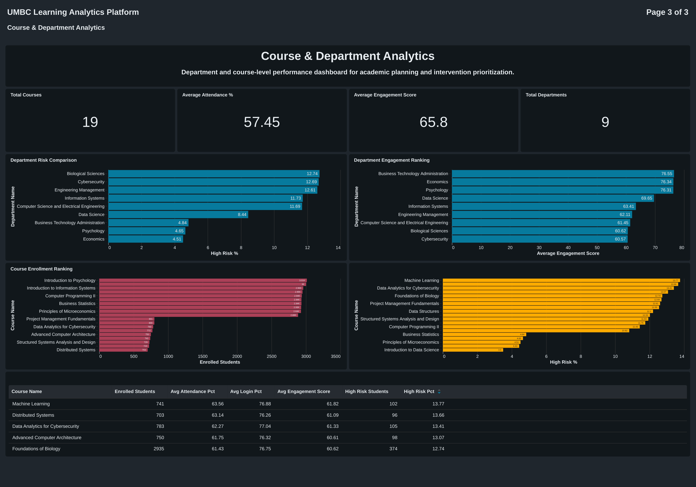

<p align="center">
  
</p>

<p align="center">


</p>

# 🎓 Learning Analytics Lakehouse Platform

> **Enterprise Data Engineering & Analytics Platform Built on Databricks Lakehouse**


---

## 📖 Overview

The **Learning Analytics Lakehouse Platform** is an end-to-end analytics solution built on the Databricks Lakehouse architecture to demonstrate how universities can transform fragmented academic and learning management system (LMS) data into actionable insights.

The platform integrates student enrollment, Blackboard LMS activity, attendance, academic performance, and behavioral engagement into a unified analytics environment using a modern Medallion (Bronze, Silver, Gold) architecture. It provides interactive executive dashboards, student success analytics, departmental performance reporting, and a rule-based intervention engine to identify students requiring academic support.

This project demonstrates enterprise-grade data engineering, analytics engineering, dimensional modeling, feature engineering, and business intelligence practices.

---

# 🚀 Project Highlights

- Designed an end-to-end Lakehouse architecture using Databricks and Delta Lake.
- Engineered scalable ETL pipelines processing over **1.3 million student activity records** and approximately **7.5 million Blackboard LMS events**.
- Built a reusable Gold semantic layer supporting executive reporting and operational analytics.
- Developed **3 interactive Databricks Lakeview dashboards** for executive leadership, student success teams, and academic departments.
- Implemented a rule-based intervention engine to identify students requiring priority academic outreach.
- Applied dimensional modeling and feature engineering to support institutional decision-making.

---

# 📊 Project Metrics

| Metric | Value |
|---------|------:|
| Students | 8,500 |
| Active Enrollments | 147,442 |
| Student Daily Activity Records | 1,316,173 |
| Blackboard LMS Events | ~7.5 Million |
| Departments | 9 |
| Courses | 19 |
| Executive Dashboards | 3 |
| Gold Semantic Views | 13 |
| SQL Analytics Queries | 18+ |

---

# 🎯 Business Problem

Higher education institutions generate millions of records every semester from Student Information Systems (SIS), Learning Management Systems (LMS), attendance tracking, and academic performance systems.

Although these systems collect valuable operational data, the information is often fragmented across multiple platforms, making it difficult for university leadership to:

- Identify at-risk students early
- Monitor academic engagement
- Track departmental performance
- Prioritize student intervention
- Make institution-wide data-driven decisions

Traditional reporting solutions typically provide historical metrics but rarely deliver a unified analytics platform capable of supporting executive decision-making and proactive student success initiatives.

---

# 💡 Solution

The Learning Analytics Lakehouse Platform consolidates academic and behavioral data into a scalable analytics platform built on the Databricks Lakehouse.

The solution processes raw operational data through Bronze, Silver, and Gold layers before exposing curated semantic views that power interactive dashboards for multiple stakeholders.

The platform supports:

- Executive reporting
- Student success monitoring
- Academic intervention prioritization
- Department performance analysis
- Course-level analytics

---

# 🏗️ Architecture


The platform follows the Medallion Architecture:

```
Blackboard LMS
Student Information System
Attendance
Course Data

        │

        ▼

Bronze Layer
(Raw Delta Tables)

        │

        ▼

Silver Layer
(Cleaned & Standardized Data)

        │

        ▼

Gold Layer
Business Semantic Views

        │

        ▼

Databricks SQL

        │

        ▼

Lakeview Dashboards
```

---

# 🧱 Data Pipeline

```
Synthetic University Data
        │
        ▼
Raw Delta Tables
        │
        ▼
Data Cleaning
        │
        ▼
Feature Engineering
        │
        ▼
Student Success Features
        │
        ▼
Gold Semantic Layer
        │
        ▼
Executive Dashboards
```

---

# 🛠 Technology Stack

| Category | Technologies |
|----------|--------------|
| Platform | Databricks Lakehouse |
| Storage | Delta Lake |
| Processing | Apache Spark, Spark SQL |
| Programming | Python, SQL |
| Analytics | Databricks SQL |
| Dashboards | Databricks Lakeview |
| Data Modeling | Medallion Architecture, Star Schema |
| Version Control | Git, GitHub |

---

# 🏛 Data Model

Core entities include:

- Students
- Enrollments
- Courses
- Departments
- Semester Calendar
- Blackboard LMS Events
- Student Daily Activity
- Student Success Features
- Course Performance Summary
- Department Performance Summary

---

# 📂 Repository Structure

```
learning-analytics-lakehouse-platform/

│
├── architecture/
├── dashboards/
├── docs/
├── images/
├── notebooks/
├── sample_data/
├── screenshots/
├── sql/
├── README.md
├── LICENSE
└── .gitignore
```

---

# 📈 Gold Semantic Layer

The platform exposes reusable business-friendly semantic views including:

### Executive Analytics

- vw_executive_kpis
- vw_daily_lms_trend
- vw_department_performance
- vw_course_risk_ranking
- vw_risk_distribution

### Student Success Analytics

- vw_behavior_profile_performance
- vw_student_level_performance
- vw_engagement_correlation
- vw_intervention_priority
- vw_priority_outreach_queue

### Academic Analytics

- vw_department_summary
- vw_course_summary
- vw_course_enrollment

---

# 📊 Dashboards

# Dashboard Showcase

## Executive Overview

**Audience:** University Leadership

**Purpose**

Provides a real-time institutional overview of academic performance, student engagement, and risk metrics through executive KPIs.

**Highlights**

- Executive KPIs
- Academic Risk Distribution
- Weekly Blackboard LMS Activity
- Department Risk Comparison
- Course Risk Ranking



---

## Student Success & Retention

**Audience:** Academic Advisors & Student Success Teams

**Purpose**

Identifies students requiring intervention through behavioral analytics and engagement monitoring.

**Highlights**

- Student Engagement Analysis
- Behavior Profiles
- Attendance vs Engagement
- Student Level Risk
- Priority Outreach Queue



---

## Course & Department Analytics

**Audience:** Department Chairs & Academic Leadership

**Purpose**

Evaluates departmental and course-level performance to support institutional planning.

**Highlights**

- Department Performance
- Course Enrollment
- Department Engagement
- Course Risk Ranking
- Course Performance Summary



---

# 📌 Key Business Insights

The platform enables institutions to:

- Identify students requiring early academic intervention
- Monitor student engagement using Blackboard LMS activity
- Track departmental academic performance
- Compare course-level risk indicators
- Support executive decision-making using interactive dashboards
- Prioritize student outreach based on behavioral analytics

---

# 📈 Feature Engineering

Student engagement is derived using engineered features including:

- Attendance Percentage
- Blackboard Login Percentage
- Assignment Submission Percentage
- Quiz Participation
- LMS Activity Frequency
- Engagement Score
- Academic Risk Classification
- Intervention Priority

---

# 🔍 Data Engineering Highlights

- Delta Lake architecture
- Bronze → Silver → Gold pipeline
- Dimensional modeling
- Star schema design
- Incremental transformations
- Semantic layer design
- Business KPI modeling
- Analytics engineering best practices

---

# 🚀 Future Enhancements

- Real-time Blackboard event streaming using Apache Kafka
- ML-based student dropout prediction
- AI-powered academic advisor assistant
- Automated intervention recommendations using Generative AI
- Power BI and Tableau integrations
- AWS Lakehouse deployment
- Unity Catalog governance
- CI/CD pipeline for analytics workflows

---

# 📚 Skills Demonstrated

- Data Engineering
- Analytics Engineering
- Data Warehousing
- Delta Lake
- Apache Spark
- SQL
- Python
- Databricks Lakehouse
- Feature Engineering
- Business Intelligence
- Dashboard Development
- KPI Design
- Semantic Layer Design
- Data Modeling

---

# ▶️ Getting Started

Clone the repository:

```bash
git clone https://github.com/OmkarK23/learning-analytics-lakehouse-platform.git
```

Open the Databricks notebooks and execute them in sequence:

1. Generate synthetic university data
2. Load Bronze Delta tables
3. Transform data into Silver layer
4. Create Gold semantic views
5. Execute SQL analytics queries
6. Build Lakeview dashboards

---

# 👤 Author

**Omkar Kalekar**

MS Information Systems, University of Maryland, Baltimore County

GitHub: https://github.com/OmkarK23

LinkedIn: https://www.linkedin.com/in/omkar-kalekar/

Portfolio: (https://omkark23.github.io/portfolio-website/)

---

## ⭐ If you found this project interesting, consider giving it a star!