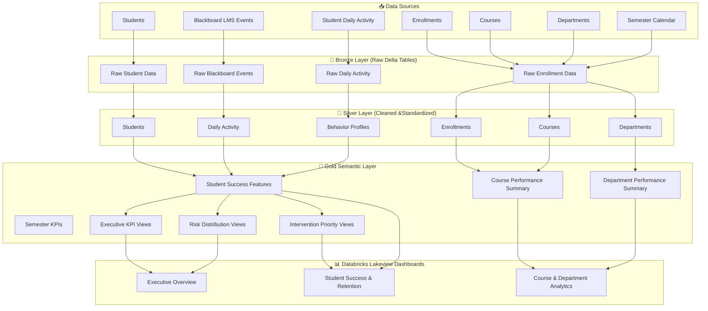

# Learning Analytics Lakehouse Platform Architecture

## Overview

The Learning Analytics Lakehouse Platform follows the Medallion (Bronze, Silver, Gold) architecture on Databricks. Raw university data from multiple operational systems is ingested into Bronze tables, transformed into standardized Silver tables, and curated into Gold semantic views that power executive dashboards and analytics.

---

## Architecture Diagram

---

## Medallion Architecture

### Bronze Layer
Stores raw synthetic university datasets exactly as generated with minimal transformation.

### Silver Layer
Applies cleansing, normalization, joins, and feature engineering to create standardized datasets for analytics.

### Gold Layer
Contains business-ready semantic views, aggregated metrics, KPIs, and intervention models that power dashboards.

---

## Dashboards Powered

### Executive Overview
- Executive KPIs
- Risk Distribution
- LMS Trends
- Department Performance
- Course Risk Ranking

### Student Success & Retention
- Student Engagement
- Behavior Profiles
- Risk Analysis
- Priority Outreach Queue

### Course & Department Analytics
- Department Performance
- Course Enrollment
- Course Risk
- Academic Performance

---

## Business Value

This architecture enables universities to:

- Centralize fragmented academic data
- Monitor student engagement
- Detect at-risk students early
- Support executive decision-making
- Improve institutional performance through data-driven interventions